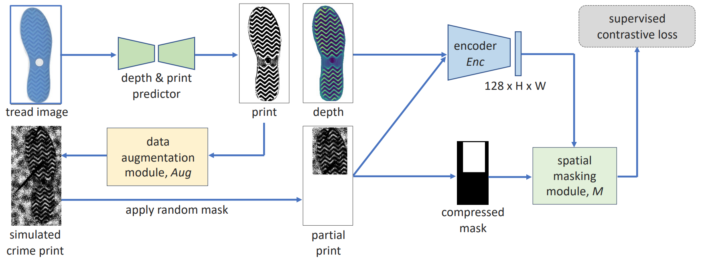
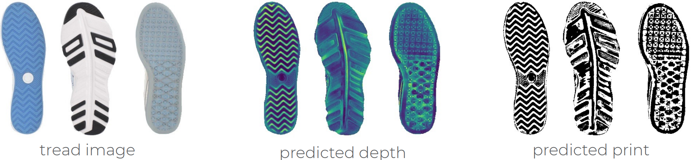
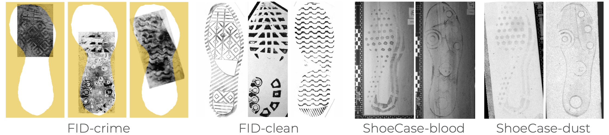

# CriSp: Leveraging Tread Depth Maps for Enhanced Crime-Scene Shoeprint Matching

This is the official project page for our paper:

[CriSp: Leveraging Tread Depth Maps for Enhanced Crime-Scene Shoeprint Matching](https://arxiv.org/abs/2404.16972)

[Samia Shafique](https://sites.google.com/site/samiashafique067/), [Shu Kong*](http://www.cs.cmu.edu/~shuk/), and [Charless Fowlkes*](https://www.ics.uci.edu/~fowlkes/)

[ECCV 2024](https://eccv.ecva.net/Conferences/2024)

### Abstract
<p align="justify">
    Shoeprints are a common type of evidence found at crime scenes and are used regularly in forensic investigations. However, existing methods cannot effectively employ deep learning techniques to match noisy and occluded crime-scene shoeprints to a shoe database due to a lack of training data. Moreover, all existing methods match crime-scene shoeprints to clean reference prints, yet our analysis shows matching to more informative tread depth maps yields better retrieval results. The matching task is further complicated by the necessity to identify similarities only in corresponding regions (heels, toes, etc) of prints and shoe treads. To overcome these challenges, we leverage shoe tread images from online retailers and utilize an off-the-shelf predictor to estimate depth maps and clean prints. Our method, named CriSp, matches crime-scene shoeprints to tread depth maps by training on this data. CriSp incorporates data augmentation to simulate crime-scene shoeprints, an encoder to learn spatially-aware features, and a masking module to ensure only visible regions of crime-scene prints affect retrieval results. To validate our approach, we introduce two validation sets by reprocessing existing datasets of crime-scene shoeprints and establish a benchmarking protocol for comparison. On this benchmark, CriSp significantly outperforms state-of-the-art methods in both automated shoeprint matching and image retrieval tailored to this task. 
</p>


**Keywords**: Shoeprint Matching, Image Retrieval, and Forensics 

### Overview 


<p align="center">



</p>

<p align="justify">

We develop a method termed CriSp to compare crime-scene shoeprints against a database of tread depth maps (predicted from tread images collected by online retailers) and retrieve a ranked list of matches. We train CriSp using tread depth maps and clean prints as shown above. We use a data augmentation module <i>Aug</i> to address the domain gap between clean and crime-scene prints, and a spatial feature masking strategy (via spatial encoder <i>Enc</i> and masking module <i>M</i>) to match shoeprint patterns to corresponding locations on tread depth maps. CriSp achieves significantly better retrieval results than the prior methods.

</p>


### Datasets

We introduce a training set of synthesized tread depth maps and clean shoeprint images from shoe tread images, 
along with two validation sets to evaluate the performance of methods. 

#### Training Set


<p align="center">



</p>


<p align="justify">

We train our model on a dataset of aligned shoe tread depth maps and clean shoeprints. For the dataset creation, we leverage shoe-tread images available from online retailers and predict their depth maps and prints as outlined by [ShoeRinsics](https://openaccess.thecvf.com/content/WACV2023/html/Shafique_Creating_a_Forensic_Database_of_Shoeprints_From_Online_Shoe-Tread_Photos_WACV_2023_paper.html). The diagram above presents some examples from our training set.
Our training set contains 21,699 shoe instances from 4,932 different shoe models. 
[Download](https://drive.google.com/drive/folders/1EHcAiaOv7ihXQT4xhzfUE3aXE9RIKRRJ?usp=sharing)


#### Validation Sets


<p align="center">



</p>


<p align="justify">


To study the effectiveness of models, we introduce a large-scale reference database (ref-db) of tread depth maps, along with two validation sets (val-FID and val-ShoeCase).

1. <b>Ref-db</b>: 
We introduce a reference database (ref-db) by extending train-set to include more shoe models. The added shoe models are used to study generalization to unseen shoe models. Ref-db contains a total of 56,847 shoe instances from 24,766 different shoe models. 
[Download]()

2. 

We create our validation sets by reprocessing existing datasets of real and simuated crime-scene shoeprints from [FID300](https://fid.dmi.unibas.ch/) and [ShoeCase](https://www.sciencedirect.com/science/article/pii/S2352340923006467), respectively. 
We match shoeprints from the validation sets to ref-db and add labels connecting shoeprints in val-FID and val-ShoeCase to ref-db to enable quantitative analysis.
Example clean and crime-scene prints from our validation sets are shown above.
Download links: [ref-db](), [val-FID](), and [val-ShoeCase]().

//////////////////////////////

The details and download links of each dataset are as follows:


4. <b>Real-FID-val</b>: This dataset contains 41 sets of shoe-tread images, shoeprints, and masks.

Note that the shoeprints in this dataset come from the [FID300](https://fid.dmi.unibas.ch/) dataset 

while the shoe-tread images are separately downloaded from online retailers 

(i.e., these images are disjoint from those in the real-train set). 

We find matched FID300 prints (used as the ground-truth) and the downloaded shoe-tread images,

and align them manually. Real-FID-val contains 41 new, athletic shoe-tread images with 

corresponding ground-truth shoeprints and masks to segment out the shoe-treads.

[Download](https://drive.google.com/drive/folders/1feHRI1_wErloXhmDpbTiorUaOwS6J5IO?usp=share_link)


You can view and download all the datasets together [here](https://drive.google.com/drive/folders/1I2EW2rSv9sr4YPCM1UQAkmuF_QzMs4pM?usp=sharing).


### Reference

If you find our work useful in your research, please consider citing our paper:

```

@article{shafique2024crisp,
  title={CriSp: Leveraging Tread Depth Maps for Enhanced Crime-Scene Shoeprint Matching},
  author={Shafique, Samia and Kong, Shu and Fowlkes, Charless},
  journal={arXiv preprint arXiv:2404.16972},
  year={2024}
}

```


### Questions

Please feel free to email me at (sshafiqu [at] ics [dot] uci [dot] edu) if you have any questions.


### Acknowledgements

This work was funded (or partially funded) by the Center for Statistics and Applications in Forensic Evidence (CSAFE) through Cooperative Agreements 70NANB15H176 and 70NANB20H019 between NIST and Iowa State University, which includes activities carried out at Carnegie Mellon University, Duke University, University of California Irvine, University of Virginia, West Virginia University, University of Pennsylvania, Swarthmore College and University of Nebraska, Lincoln.
Shu Kong is partially supported by the University of Macau (SRG2023-00044-FST).
